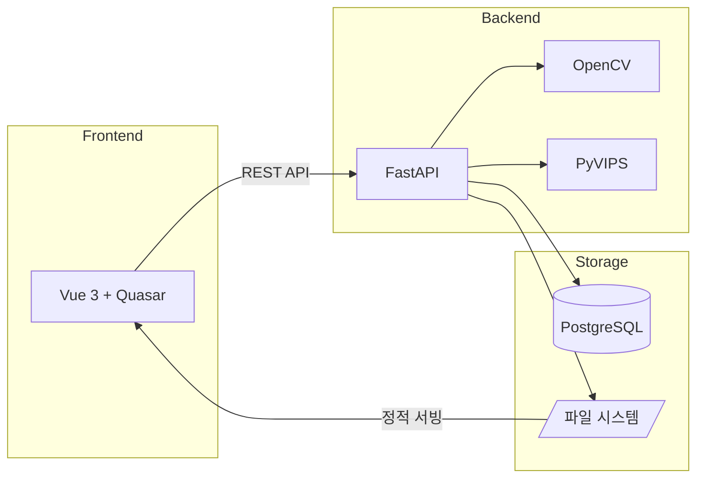
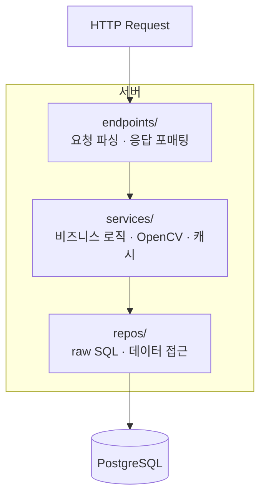
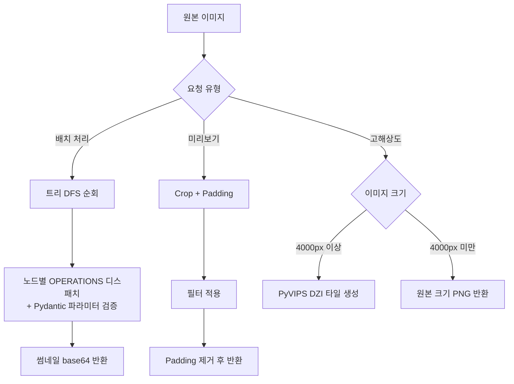
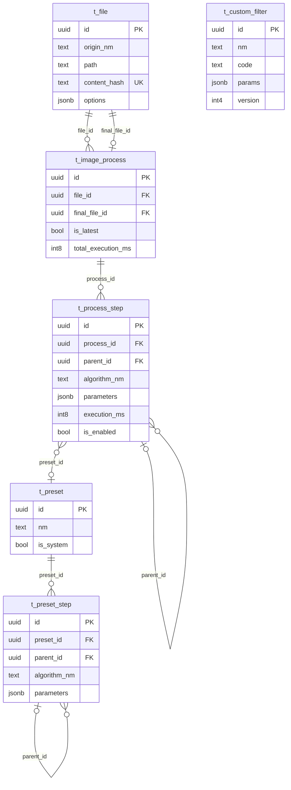

# Image Processing Server

> 노드 기반 비파괴 이미지 편집 시스템의 백엔드 서버

원본 이미지를 변경하지 않고, 처리 파라미터만 트리 구조로 저장하여 언제든 재계산할 수 있는 이미지 처리 API 서버입니다.
다양한 필터 함수와 파라미터를 적용하여 적절한 이미지 처리 알고리즘을 설계해볼 수 있도록 하기 위한 용도입니다.

### 노드 기반 이미지 처리


### 프리셋 저장 & 불러오기


### 고해상도 확대 편집


## 왜 만들었나

이미지에 여러 필터를 순차 적용할 때, 중간 단계를 수정하면 이후 결과를 모두 다시 만들어야 합니다.
이 문제를 해결하기 위해 **비파괴 편집 모델**을 설계했습니다:

- 원본 이미지는 그대로 보존
- 필터 체인을 **트리 구조의 메타데이터**로 저장
- 파라미터 변경 시 해당 노드부터 재계산
- 같은 입력에 여러 필터를 **분기(sibling)** 로 비교 가능

## 핵심 기능

### 35+ 이미지 필터

OpenCV 기반 필터를 파라미터 모델과 함께 제공합니다.

| 카테고리 | 필터 |
|----------|------|
| 엣지 검출 | Sobel, Prewitt, Laplacian, Canny, Roberts |
| 블러링 | Gaussian, Box, Median, Bilateral |
| 컨투어 | FindContour, ConvexHull, BoundingBox |
| 밝기 | Plus, Minus, Gamma, Histogram Equalization |
| 이진화 | Binary, Inverse, ToZero, Otsu, Adaptive |
| 형태학 | Erosion, Dilation, Opening, Closing |
| 커스텀 | 사용자 정의 Python 함수 |

### 트리 기반 배치 처리

```
원본 이미지
├── GaussianBlur (kernelSize=5)
│   ├── Sobel (dx=1, dy=0)        ← 분기 A
│   └── Canny (t1=100, t2=200)    ← 분기 B (같은 입력, 다른 알고리즘 비교)
└── Erosion (kernelSize=3)
```

하나의 요청으로 트리 전체를 DFS 순회하며 처리합니다.
각 노드는 부모 노드의 결과를 입력으로 받아 독립적으로 실행됩니다.

### 고해상도 이미지 지원 (DZI)

4000px 이상의 고해상도 이미지는 PyVIPS로 Deep Zoom Image 타일을 생성하여,
전체 이미지를 메모리에 로드하지 않고도 프론트엔드에서 탐색할 수 있습니다.

### Crop 기반 실시간 미리보기

전체 이미지를 처리하지 않고 뷰포트 영역만 crop하여 필터를 즉시 적용합니다.
padding 영역을 포함해 경계 아티팩트를 방지하고, 결과에서 다시 제거합니다.

## 기술 스택

| 구분 | 기술 |
|------|------|
| 프레임워크 | FastAPI 0.133 |
| 이미지 처리 | OpenCV 4.13 (headless) |
| 고해상도 타일링 | PyVIPS 2.2 |
| 데이터베이스 | PostgreSQL + psycopg3 (raw SQL) |
| 스키마 검증 | Pydantic v2 |
| 테스트 | pytest + httpx (AsyncClient) |

### ORM을 사용하지 않은 이유

트리 구조 쿼리(재귀 CTE, 벌크 INSERT)에서 ORM의 추상화가 오히려 방해가 되어,
psycopg3으로 직접 SQL을 작성하는 방식을 선택했습니다.

## 아키텍처

### 시스템 전체 구조



### 백엔드 레이어



### 이미지 처리 파이프라인



### 데이터베이스 ERD



### 주요 설계 결정

| 결정 | 선택 | 이유 |
|------|------|------|
| 편집 모델 | 비파괴 (메타데이터 저장) | 원본 보존, 임의 시점 재계산 |
| 워크플로우 | 트리 구조 (parent_id) | 분기로 알고리즘 비교 지원 |
| DB 접근 | psycopg3 (No ORM) | 트리 쿼리에서 ORM 오버헤드 회피 |
| 고해상도 | DZI 타일링 | 전체 로드 없이 뷰포트 단위 렌더링 |
| 미리보기 | Crop + Padding | 전체 처리 없이 즉시 결과 확인 |
| 파일 중복 방지 | SHA-256 content hash | 동일 파일 재업로드 시 기존 레코드 반환 |
| 직렬화 | CamelModel (auto alias) | Python snake_case ↔ JS camelCase 자동 변환 |

## API 엔드포인트

| 경로 | 설명 |
|------|------|
| `POST /api/files/upload` | 원본 이미지 업로드 (중복 방지) |
| `POST /api/files/process/batch-tree` | 트리 구조 배치 처리 |
| `POST /api/files/crop` | 뷰포트 crop 생성 (미리보기용) |
| `POST /api/files/crop/apply` | crop에 필터 적용 |
| `POST /api/files/dzi/{id}` | DZI 타일 생성 |
| `POST /api/files/download/{id}` | 처리 결과 다운로드 |
| `GET /api/filters/params` | 전체 필터 파라미터 스키마 |
| `/api/presets` | 프리셋 CRUD |
| `/api/processes` | 편집 세션 CRUD |
| `/api/custom-filters` | 커스텀 필터 CRUD |

## 시작하기

### 사전 요구사항

- Python 3.10+
- PostgreSQL
- libvips ([설치 가이드](https://github.com/libvips/build-win64-mxe/releases))

### 설치 및 실행

```bash
# 가상환경 생성
python -m venv .venv
source .venv/Scripts/activate    # Windows Git Bash
# .venv\Scripts\Activate.ps1     # Windows PowerShell

# 의존성 설치
pip install -r requirements.txt

# 환경변수 설정
cp .env.example .env

# 서버 실행
fastapi dev
```

- Swagger UI: http://localhost:8000/docs

### 테스트

```bash
pytest
```

## 프론트엔드

이 서버와 연동되는 프론트엔드 프로젝트: [quasar-image-processing](https://github.com/banhyungil/quasar-image-processing)

## 프로젝트 구조

```
app/
├── api/endpoints/        엔드포인트 (파일, 필터, 프리셋, 프로세스, 커스텀 필터)
├── services/             비즈니스 로직 (이미지 처리, DZI, Crop, 캐시)
├── repos/                데이터 접근 (raw SQL)
├── schemas/              Pydantic 모델 (요청/응답/파라미터)
├── core/                 설정, 로깅, 예외 처리
└── utils/                유틸리티
```
